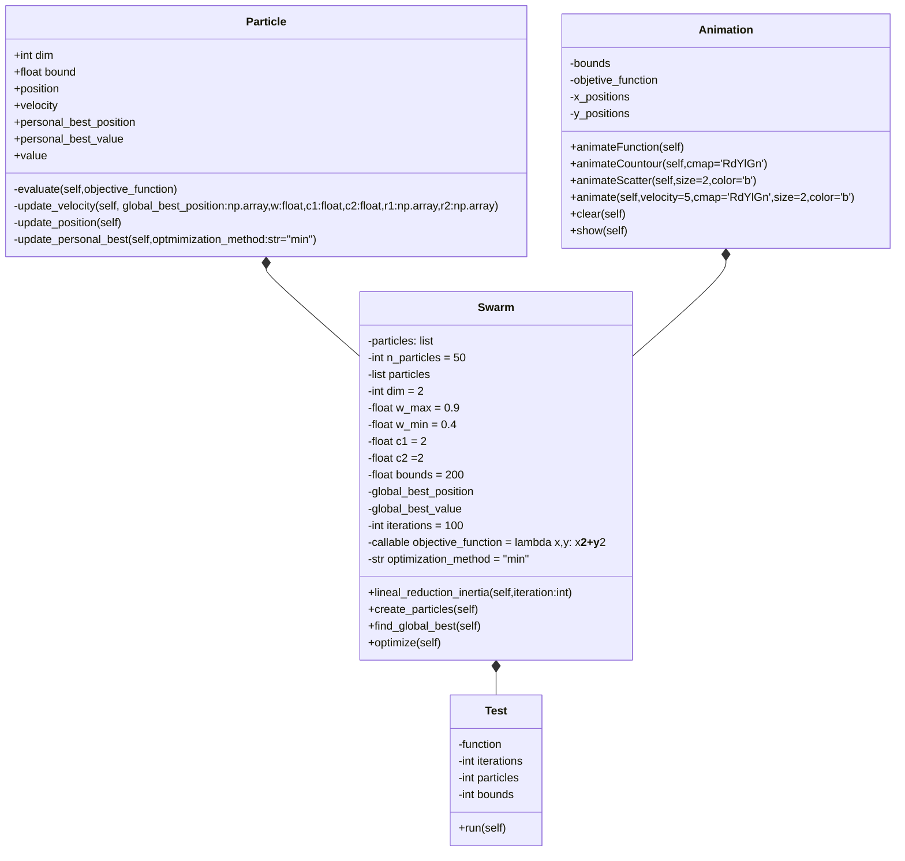

<h1 align="center">Particle swarm optimization (PSO)</h1>
<div align="center">
    
###### POO = {a, j, d : (a $\in$ II) $\land$ (d, j $\in$ CC)}
[](https://anamllanosc.github.io/PSO-Implementation/)
[](https://github.com/anamllanosc/PSO-Implementation/issues)
[](https://github.com/anamllanosc/PSO-Implementation/pulls)
</div>

----
## ℹ️ Table of Contents

- [About](#about)
- [Getting Started](#getting_started)
- [Authors](#authors)
- [Class Diagram](#diagram)

## 📂 About <a name = "about"></a>
This repo is for hosting the code of the Particle Swarm Optimization (PSO) algorithm. 
Made as the finall project for the OOP course given by @fegonzalez7 at the 
National University of Colombia.

## 👾 Getting Started <a name = "getting_started"></a>

### 😒 Prerequisites 
1. For the base package:
    - Numpy
    - Matplotlib

2. For the page deployment:
    - Streamlit

### 🎩 Installing 
1. Clone the repo:
```bash
git clone https://github.com/anamllanosc/PSO-Implementation.git
```
2. Install the requirements:
```bash
pip install -r requirements.txt
```
3. Run the main file:
```bash
python main.py
```

## 🤵 Authors <a name = "authors"></a>

- [@anamllanosc](https://github.com/anamllanosc)
- [@jorge9805](https://github.com/jorge9805)
- [@dmeloca](https://github.com/dmeloca)

### 📰 Class Diagram <a name="diagram"></a>

--------
